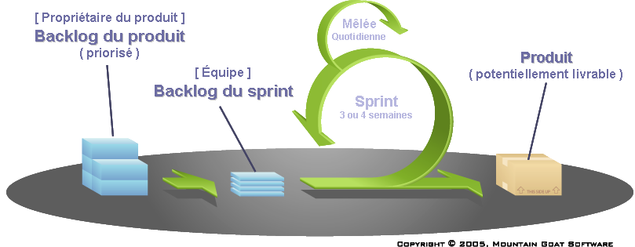
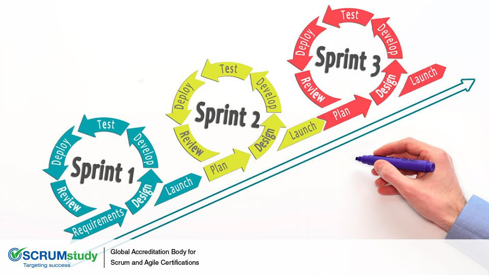

# Scrum

L'organisation du projet est inspirée de la méthode Scrum.

## Avant le projet, la liste des fonctionnalités : le BACKLOG DU PRODUIT

Avant le moindre développement, il y a une personne (un client, le commanditaire) qui imagine un produit : c'est le **propriétaire du produit**.
Afin de l'aider à expliciter ses besoins, le propriétaire du produit est assisté par le **maître de mêlée**. Le maître de mêlée ne fait pas parti de l'équipe de développement, il n'est pas un chef de projet ni un supérieur. Il est là pour faire en sorte que la méthodologie Scrum soit appliquée. Il met en place les rituels ou aide à la communication entre propriétaire du produit et équipe de développement.
À eux deux, propriétaire de produit et maître de mêlée vont écrire le **backlog du produit**. C'est la liste ordonnée des fonctionnalités du produit. Dans la méthodologie Scrum, cette liste **n'est pas figée**. Le propriétaire de produit peut changer à discrétion l'ordre des éléments, en ajouter, modifier le découpage en éléments, modifier leur description, ou supprimer des éléments qui n'ont pas encore été réalisés.

## Pendant le projet, des cycles itératifs : les SPRINTs

Une fois que le projet est lancé, la méthode Scrum consiste en une **itération d'événements** simples de durées courtes.
Toute la durée de développement du projet est segmentée en une répétition de cycle (appelés **sprint**), chacun d'une durée de 1 à 4 semaine (**à définir**).

1. **Avant** de débuter un *sprint*, l'équipe de développement défini le **Backlog du sprint** c'est à dire les fonctionnalités qui vont être développées durant le sprint. Ces fonctionnalités sont issues du *Backlog du produit*.
* **Pendant** le *sprint*, l'équipe se réuni quotidiennement : c'est la **mêlée quotidienne**. Cette discussion de 15min maximum est l'occasion pour chaque membre de l'équipe de présenter ce qu'il a réalisé la veille, ce qu'il compte réaliser le jour même pour atteindre l'objet du sprint et les obstacles qui empêchent l'équipe d'atteindre le but du sprint.
* **Après** un *sprint*,
    * l'équipe présente propriétaire du produit les fonctionnalités entièrement achevées : c'est donc une version améliorée de l'application
    * l'équipe se réunit et débriefe pour améliorer le fonctionnement du sprint suivant

La littérature concernant cette méthode est très dense et variée.

* https://fr.wikipedia.org/wiki/Scrum_(d%C3%A9veloppement)
* https://www.bettercalldave.io/methodologie/definition-scrum/
* lister les sites qui nous ont aidés...
* ...

## Projet Tournoi

En ce qui concerne le _projet tournoi_, les rôles de *propriétaire de produit* et de *maître de mêlée* ont été joués par une seule personne : **le chef de projet**. En effet, c'est au chef de projet qu'incombe la responsabilité du produit, la définition de ses fonctionnalités ainsi que ses limites. Par ailleurs, en imposant la méthode de travail Scrum, le chef de projet doit expliquer et accompagner l'équipe dans cette méthodologie. Il est donc aussi *maître de mêlée*.

Il y a plusieurs difficultés pour appliqué la méthode Scrum dans le cadre d'un projet de DU en ligne. D'abord les personnes ne travaillent pas dans un même lieu géographique, mais à **distance**. Ensuite, la quantité de travail que chaque personne peut fournir est très limitée puisque nous ne sommes pas une véritable équipe de travail qui accorde au moins 5h par jour au projet, et ce 5 jours sur 7 ! Cette méthode est organisée autours d'évènements comme la *mêlée quotidienne* qu'il n'est alors pas possible de réaliser.

Pour tenter d'appliquer au mieux la méthode Scrum, nous faisons donc en sorte de planifier les évènements avec précision. 

Nous travaillons donc de la façon suivante :

* Chaque sprint a eu une durée de **2 semaines**.
* 1 visioconférence de 1h a été réalisée au début de chaque sprint pour 
    * clôturer le sprint précédent : **revue de sprint**
    * établir la **planification du sprint** suivant
* Concernant la **mêlée quotidienne**, ...*j'ai pas d'idée*...

Le Backlog du produit est rédigé sur la vue Agile du projet (https://pp.irem.univ-mrs.fr/projects/application-tournoi/agile/board). 
On y voit une succession de post-it. Chaque bloc est une User Story : fiches détaillant une fonctionnalité attendue. Elles sont rédigées sous la forme "en tant que"..."je veux que"..."afin de"...

C'est a partir de ce *Backlog du produit* que nous établissons de *Backlog du sprint*.