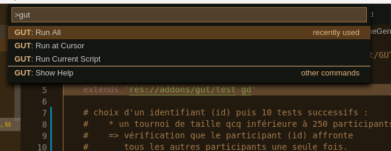
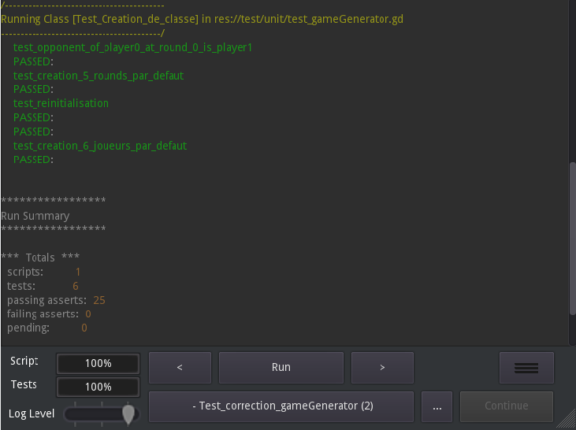
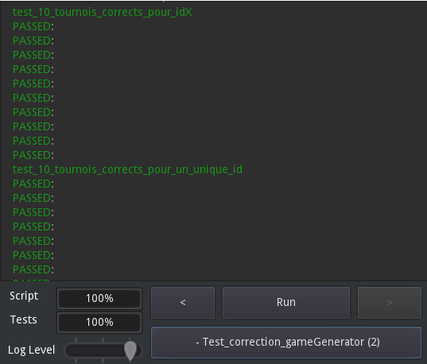

# Tests unitaires avec GUT

Conformément au cahier des charges, nous avons mis en place les tests unitaires.
Nous avons donc installé l'extension `gut pour `Godot` et ainsi que l'extension `gut-extension` pour VSCodium :

* Godot: https://github.com/bitwes/Gut/
* VSCodium: https://github.com/bitwes/gut-extension

Après avoir configuré le projet, les tests unitaires sont désormais possibles à partir de VSCodium.
Pour cela, il nous suffit de lancer une commande spécifique. Une instance de Godot se lance et les tests s'exécutent dans une fenêtre dédiée.

## La classe GameGenerator

Cette classe implémente notre propre algorithme de répartition des matchs. Ce dernier est l'algorithme central de notre application. 

Nos tests ont vérifiés :

* l'**instanciation correcte** de notre classe
* la **correction** de l'algorithme

### Test de création de classe

Nous avons mis en place 4 tests :

* instanciation de la classe sans paramètre et vérification du nombre par défaut de participant
* instanciation de la classe avec un nombre de joueur imposé et vérification que le nombre de round est correct (pour 6 joueurs, il y aura 5 rounds)
* instanciation de la classe puis modification du nombre de participant et réinstanciation. Vérification du nombre correct de participants et de rounds
* instanciation de la classe et vérification que par défaut, le participant 0 affronte lors du premier round le participant 1

### Test de correction de l'algorithme

Pour cette partie, nous avons mis en place 2 tests qui vont vérifier que :

* lors de sa participation à 10 tournois de taille aléatoire, un participant donné affronte bien à chaque fois tous les autres adversaires
* lors de 10 tournois de taille aléatoire, un joueur tiré au hasard affronte bien tous les autres adversaires.

Nous avons limité (pour des raisons de temps) ces tests à **10 tournois** de taille inférieure à **250 participants**.
Pour implémenter ces deux tests, nous avons utilisé une fonction intermédiaire qui effectue le test qu'un joueur donné affronte bien tous les adversaires pour un tournoi de taille donné.

Ces tests ont toujours été concluant (ouf).

